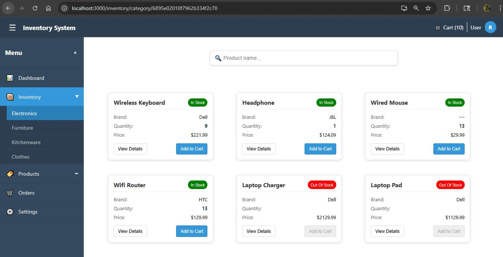
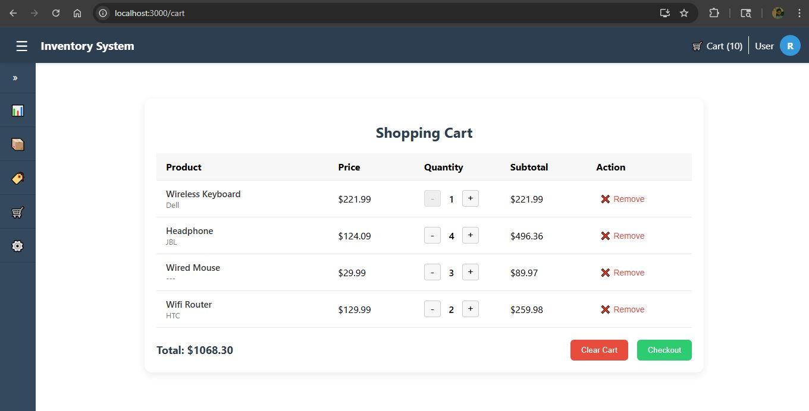

# React.js Graphql Simple Inventory System

## Introduction

This is a simple inventory management system created using React.js, and specially graphql is chosen for the backend. 



<hr>

## Features

Available features of the software,

- Inventory page with the product items.
- Product items are categorized under their usage.
- Can use the realtime search bar for find product items.
- All available products can be added to the cart.
- Cart items can be changed under the cart page.
- Cart items data is validated and also sync with the related inventory data.

## Getting Started

- Install the node modelues using npm install command.

```bash
$ npm install
```

## Compile and run the project

```bash
# development
$ npm start
```

### Prerequisites

All the dependencies are mentioned in the package.json file.
